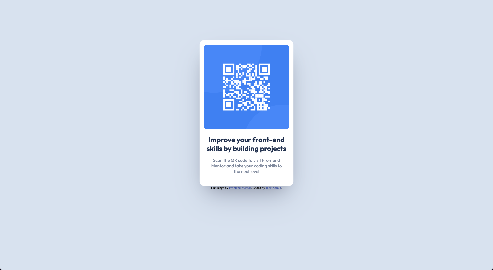

# Frontend Mentor - QR code component solution

This is a solution to the [QR code component challenge on Frontend Mentor](https://www.frontendmentor.io/challenges/qr-code-component-iux_sIO_H). Frontend Mentor challenges help you improve your coding skills by building realistic projects. 

## Table of contents

- [Overview](#overview)
  - [Screenshot](#screenshot)
  - [Links](#links)
- [My process](#my-process)
  - [Built with](#built-with)
  - [What I learned](#what-i-learned)
  - [Continued development](#continued-development)
- [Author](#author)

**Note: Delete this note and update the table of contents based on what sections you keep.**

## Overview

### Screenshot

### Links

- Solution URL: [Github](https://github.com/jackzorola10/qr-code-component-main)
- Live Site URL: [Github Pages](https://jackzorola10.github.io/qr-code-component-main/)

## My process

### Built with

- Semantic HTML5 markup
- CSS
- Media Queries

### What I learned

I mostly tried to be efficient with the code. 

### Continued development

Nothing in particular to add here, but any comments for improvement are welcome!

I do have a doubt and that is if I could've done the margin-right and margin-left part in the .card in a better way.

## Author

- Website - [Jack Zorola](https://www.your-site.com)
- Frontend Mentor - [@jackzorola10](https://www.frontendmentor.io/profile/jackzorola10)
- Twitter - [@jackzorola](https://twitter.com/jackzorola)

